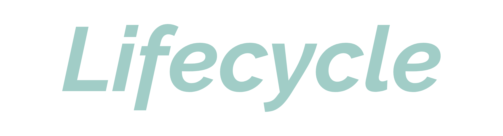

<h1 align="center">
  
</h1>

  An application that monitors your sleep and mood cycle.

 
  
 

## Project

No one could imagine that a pandemic would arise, and as we were taken by surprise, we still haven't learned how to deal with it.

Afraid, hopeless, our bodies didn't rest well, our biological cycles went out of whack and we are still paying the price.

Reaching out to anyone in need, we've built the Lifecycle app, which helps you monitor and regulate your sleep and mood cycle.

## Prototype

We made a prototype of the main screens in HTML and CSS.

This is the link to the <a href="http://uffs.jmartini.me/saude-mental-app.html">online prototype</a>.

## Methodology
The project started with research to validate the pain of our personas.

For that, we made the following <a href="https://forms.gle/LFZA6vXYwy3s8vCn7">research</a>.

We decided to use the <a href="https://www.desenvolvimentoagil.com.br/scrum/">agile scrum methodology</a>.

In this project, the sprints lasted fifteen days each.

Much of the project was built following the ideas of <a href="https://dschool.stanford.edu/resources/dschool-reading-list">design thinking by stanford</a>.

## Technologies

- HTML
- CSS
- JavaScript
- Node
- React
- Firebase

## License
This project is under a private license, that is, its code cannot be distributed, modified or used by third parties.
